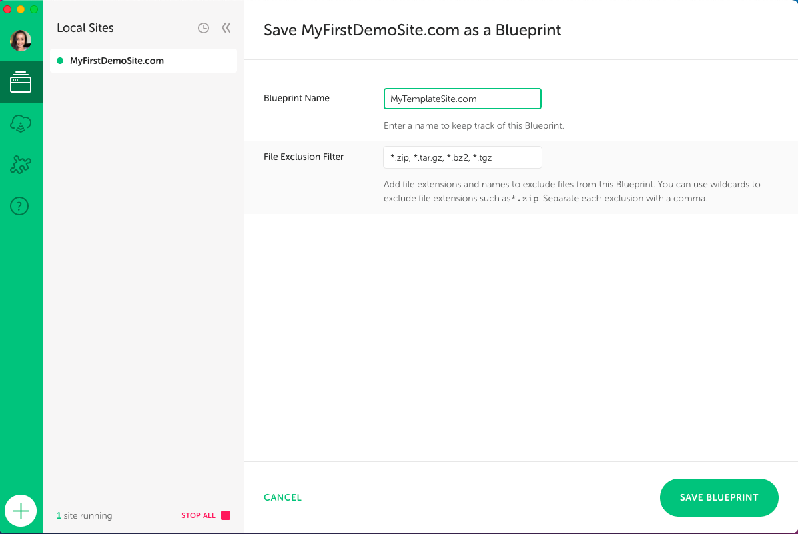

# Installing a Web Server and WordPress on Localhost

Any WordPress developer should develop on a local webserver, and it's a quick and direct way to see your code in action.

Environment
- How to install server 
- How to create a database
- How to install WordPress


## Installing XAMPP on MacOS X;
* Setting up a webserver and get WordPress to work properly on a MacOS is definitely a challenge.
* Go to XAMPP‘s <a href="https://www.apachefriends.org/index.html" target="_blank">website</a>  and find the big green Download area. Click on “XAMPP for OS X”.
  
* Tip: to convert .bz2 to .dmg (Just rename).
* Follow the setup guide, and when asked, drag the icon to the Applications folder.
* When XAMPP starts up for the first time, you'll need to click the button "Start."
  
* At this point, the webserver and database server is up and running at the provided IP address. But we want to use a nice localhost URL instead of the IP. 
 
* Click the tab "Network" and on the line "localhost:8080" click the button Enable.
  
* After this line turns green, open up the URL http://localhost:8080/ in your browser. You should see XAMPP's welcome page. This means the webserver is up and running.
* To gain access to the web project folder where you will place WordPress and any other project files, you need to go to the tab Volumes in XAMPP. Click the button "Mount."
  
* XAMPP should now be running the webserver and MySQL database server successfully, ready for you to install WordPress.

## Where do I put the web project/WordPress files?
For XAMPP the folder for your web project files will be in the subfolder ‘htdocs‘ inside the XAMPP application folder. You can open up this folder directly from inside the XAMPP app > Volumes > Explore. This opens up Finder showing the parent directory, and you will find the folder ‘htdocs‘ there.

The folder is located at /Users/<youruser>/.bitnami/stackman/machines/xampp/volumes/root/htdocs where you replace <youruser> with your Mac username. I suggest dragging the htdocs folder into your Favorites to avoid manually navigating this path over and over again!


## Installing WampServer on Windows;
* Installing a web server for Windows is pretty straightforward. It's mostly about following the setup wizard so that I won't go into much detail here.

* After the database has been created you can close phpMyAdmin. The next step is setting up WordPress’ config file.

Navigate to your WordPress folder. Make a copy of the file wp-config-sample.php and rename the copy to wp-config.php. Open wp-config.php and edit the following lines (assuming your database name is ‘wordpress‘);
```
define( 'DB_NAME', 'wordpress' );
define( 'DB_USER', 'root' );
define( 'DB_PASSWORD', '' );
```
Leave the rest as is, save and close the file.


## WordPress starter theme
Understrap WordPress Theme Framework.<a href="https://github.com/understrap/understrap" target="_blank"> understrap GitHub</a> 
### Basic Features
* Combines Underscore’s PHP/JS files and Bootstrap’s HTML/CSS/JS.
* Comes with Bootstrap (v4) Sass source files and additional .scss files. Nicely sorted and ready to add your own variables and customize the Bootstrap variables.
* Uses a single minified CSS file for all the basic stuff.
* Font Awesome integration (v4.7.0)
* Jetpack ready
* WooCommerce support
* Contact Form 7 support
* Child Theme ready
* Translation ready


# Local by flywheel

* https://localwp.com/
* Allow us to change the file on mac called the hosts file 
* Like an actual domain on the internet, but it's actually not your computer; just think it is.
* if we are login, see it's an actual running WordPress site. You can develop a site right here, like on a live domain name on a live server, but you're doing it locally.


* And you can copy this link and send this to a client, and then they can view the site from their computer wherever they are using this link they load it right from your computer. This you don't want to have it on time. 
* So you turn on the live link you'd send to your client a link you'd ask them to look at the site and say, can you let me know when you're done. so I can disable the live link. 
* Because if this is shared around, anybody can access it.
* Inside WordPress, you can install plugins and license plugins. Most plugins can reach out to servers on this local site 
* Then can transfer to the real domain name and real server when you're done.
* If you need help transferring it out, you use migration plugins for that or backup plugins.  
## Blueprint
* let's say you build a lot of eCommerce sites or business sites or whatever kind of site for your customers 
* You have a base version that you start from every time to be more efficient.
* You have a base version of the site that you upload anywhere you start customizing to meet your customer's needs.
* To create that blueprint that starting version right out of the flywheel
  
  

* Right-click on any website, and you choose to save as blueprint.

* And now, any time we click on the plus to a new site under advanced options, we can choose a blueprint 

* You can have multiple you have as many as you want. Mytemplatesite is a blueprint for maybe business sites. So every business site I start. I start with this blueprint, and that makes my work just a whole lot faster  


* This little button right here, this little arrow takes you to the files inside of that website on your computer 
> app/public / wp-content / themes 
* So open the folder you go to the app, then you go to the public and here all the WordPress files right in here. The theme files have been in wp-content.   


# WordPress- style.css file
* create a new folder call chili
* reload the site. go to the dashboard will see  Broken themes
  
* create style.css file and add information 
* Add screenshot.png
  
  

> style.css
  ```
/* 
Theme Name: Chili
Author: Kanjamad Bosel
Author URI : HTTP: //kanjamad.com
Description: The official theme for coding
Version: 1.0
*/

  ```


# Coding of functionality
## WordPress- linking CSS and JS
* get_stylesheet_uri()  only works for the style.css file in the root folder of your theme.
  
> functions.php
```
<?php

// adding the CSS and JS files

function gt_setup() {
<!-- Link Google fonts -->
  wp_enqueue_style('google-fonts', '//fonts.googleapis.com/css?family=Roboto|Roboto+Condensed|Roboto+Slab');

<!-- Link Fontawesome -->
  wp_enqueue_style('fontawesome', '//use.fontawesome.com/releases/v5.1.0/css/all.css');

<!-- add CSS file --> 
  wp_enqueue_style('style', get_stylesheet_uri());

<!-- add JS file -->  
  wp_enqueue_script("main", get_theme_file_uri('/js/main.js'), NULL, '1.0.0', true);
}

add_action('wp_enqueue_scripts', 'gt_setup');

?>

```

* add function in header.php
```
<?php wp_head(); ?>
```
```
<!DOCTYPE html>
<html lang="en">
<head>
    <meta charset="UTF-8">
    <meta http-equiv="X-UA-Compatible" content="IE=edge">
    <meta name="viewport" content="width=device-width, initial-scale=1.0">
    <title>Coding</title>

    <?php wp_head(); ?>

</head>
    <header>
        <h1>Hearder here</h1>

    </header>
<body>
    
```
* add function in footer.php
```
<?php wp_footer(); ?>
```
```

<footer>
    <p>Footer goes here</p>
</footer>

    <?php wp_footer(); ?>
</body>
</html>
```

* Connect header file and footer file to index.php
> index.php
```
<?php get_header(); ?>

<h2> Hi from php </h2>

<?php get_footer(); ?>

```


## Custom Post Type

> Before

```
// Adding Theme Support

function gt_init() {
  add_theme_support('post-thumbnails');
}

add_action('after_setup_theme', 'gt_init');
```


## Projects Post Type


* Add icon go to Developer Resources Dashicons : <a href="https://developer.wordpress.org/resource/dashicons/#media-document" target="_blank">website</a> 

```
// Projects Post Type

function gt_custom_post_type() {
  register_post_type('project',
    array(
      'rewrite' => array('slug' => 'projects'),
      'labels' => array(
        'name' => 'Projects',
        'singular_name' => 'Project',
        'add_new_item' => 'Add New Project',
        'edit_item' => 'Edit Project',
      ),
      'menu-icon' => 'dashicons-clipboard',
      'public' => true,
      'has_archive' => true,
      'supports' => array(
        'title', 'thumbnail', 'editor', 'excerpt', 'comments',
      ),
    )
  );
}

add_action('init', 'gt_custom_post_type');
```


# Template Hierarchy
https://developer.wordpress.org/themes/basics/template-hierarchy/
* The template hierarchy is the choice structure WordPress uses to determine what file in the theme will be used to generate the full, final HTML for a given page of your WordPress website.

## WordPress- while loop
* Here, we are creating an object of a pre-defined class in WordPress called WP_Query responsible for dealing with the type of query required for the page.
* By creating an object, we can customize how WP_Query should work.
* Here we are running the have_posts() and the_post() methods on our $blogposts object.
```
<?php get_header(); ?>

<?php

    $args = array(
        'post_type' => 'project',
    );

    $blogposts = new WP_Query($args);

  while (have_posts()) {
    $blogposts->the_post();
  ?>
    
    <a href="<?php echo the_permalink(); ?>">
    <h3><?php the_title();?></h3>
    </a>
    <?php the_excerpt(); ?>

    <?php
    }    
    ?>

<?php get_footer(); ?>
```

* Also, we can display the number of posts on the screen
```
<?php get_header(); ?>

<?php

    $args = array(
        'post_type' => 'post',
        'posts_per_page' => 3,
    );

    $blogposts = new WP_Query($args);

  while (have_posts()) {
    $blogposts->the_post();
  ?>
    
    <a href="<?php echo the_permalink(); ?>">
    <h3><?php the_title();?></h3>
    </a>
    <?php the_excerpt(); ?>

    <?php
    }    
    ?>

<?php get_footer(); ?>
```

## Comments
* How to customize comment form
*  https://developer.wordpress.org/reference/functions/comment_form/
  
```
$fields =  array(
  'author' =>
  '<input id="author" placeholder="Name" name="author" type="text" value="' . esc_attr( $commenter['comment_author'] ) .
  '" size="30"' . $aria_req . ' />',

  'email' =>            
  '<input id="email" name="email" placeholder="Email" type="text" value="' . esc_attr(  $commenter['comment_author_email'] ) .
  '" size="30"' . $aria_req . ' />',
);
```
```
 $args = array(
  'title_reply' => 'Share Your Thoughts',
  'fields' => $fields,
  'comment_field' => '<textarea id="comment" placeholder="Your Comment" name="comment" cols="45" rows="8" aria-required="true"></textarea>',
  'comment_notes_before' => '<p class="comment-note">Your email address will not be published. All fields are required.</p>'
); 
```

## Sidebar and Widgets 

> functions.php
```
function gt_widgets(){
  register_sidebar( 
      array(
          'name' => 'Main Sidebar',
          'id'   => 'main_sidebar',
          'before_title'  => '<h3>',
          'after_title'   => '</h3>'
      )
      );
}

add_action('widgets_init', 'gt_widgets');
```


## Custom 404 Page

"
<?php
    get_header();
?>

  <!-- Container for 404 Page -->

    <div class="container-404">

        <h2 class="page-heading">404</h2>
        
        <h3>Page Not Found, I think you're lost. Plz try the following links</h3>

        <ul>
          <li><a href="<?php echo site_url('/blog')?>">Blog List</a></li>
          <li><a href="<?php echo site_url('/projects')?>">Projects List</a></li>
          <li><a href="<?php echo site_url('/about')?>">About Me</a></li>
          <li><a href="<?php echo site_url('')?>">Home Page</a></li>
        </ul>

    </div> 

<?php    
    get_footer();   
?>
"

## Finishing Up
* Now you can zip this file, and use it so much you want
